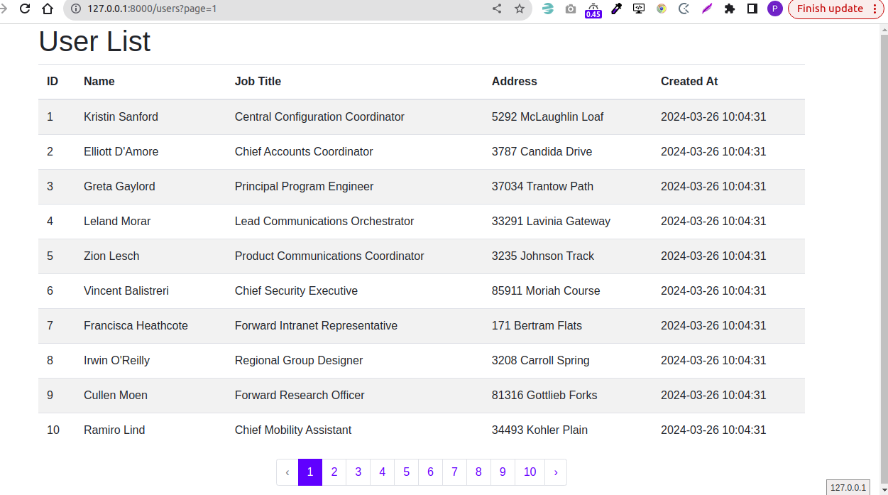
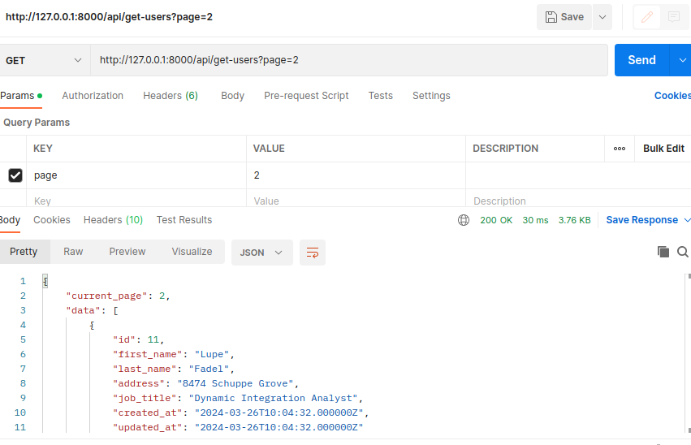
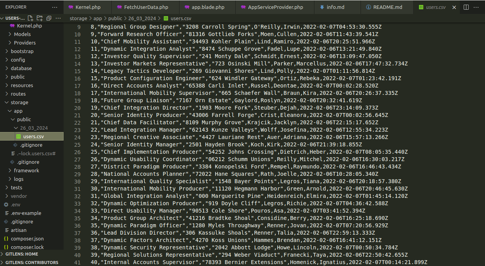

# Files

Provided is a clean install of Laravel.  You are given 24 hours to finish the assignment.  You are allowed to install and utilize any package you feel will help you get the job done.

# Problem to Solve

The purpose of this test is to gauge your skills in the day-to-day problems.  For example, we deal with a fair amount of ETL (extract, transform, load) processes so it's only natural for us to give you a basic ETL task.  To start, we will need to get the results from an API every 24 hours.  We will then need to save that data to a file and process it into our database.  Once that's complete, we will also need the ability retrieve those results using an API endpoint.  Also include tests for the code. 

## Resources
[API URL](https://61f07509732d93001778ea7d.mockapi.io/api/v1/user/users?page=1&limit=10)

Please use this link to fetch all users.  The list is paginated.  There is a max of 10 pages.  This number can be changed by altering the limit query parameter.

## Project setup:
## Requirements : php 8.1

1) composer install 
2) create .env file by copying the .env.example file
3) change the db credential 
3) php artisan migrate 
4) php artisan key:generate 
5)  php artisan fetch:user-data // getting the user data from api

## Results : - 

1) The record will be shown on the web => http://127.0.0.1:8000/users
  
2) Run this command for getting the users:

   php artisan fetch:user-data
   
3) APi url for getting the user 
  
  http://127.0.0.1:8000/api/get-users?page=10  - you can change the current page by changing the page params in the url
     
4) The record will be save in storage/app/public/

  Run the command : php artisan storage:link for showing the users.csv file inside public folder
 